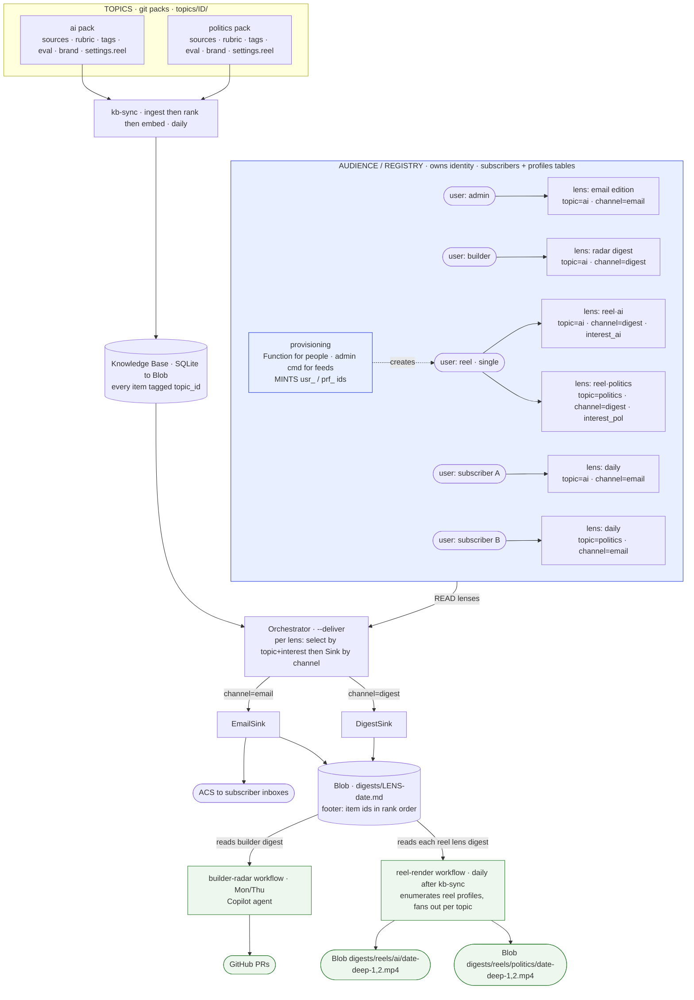
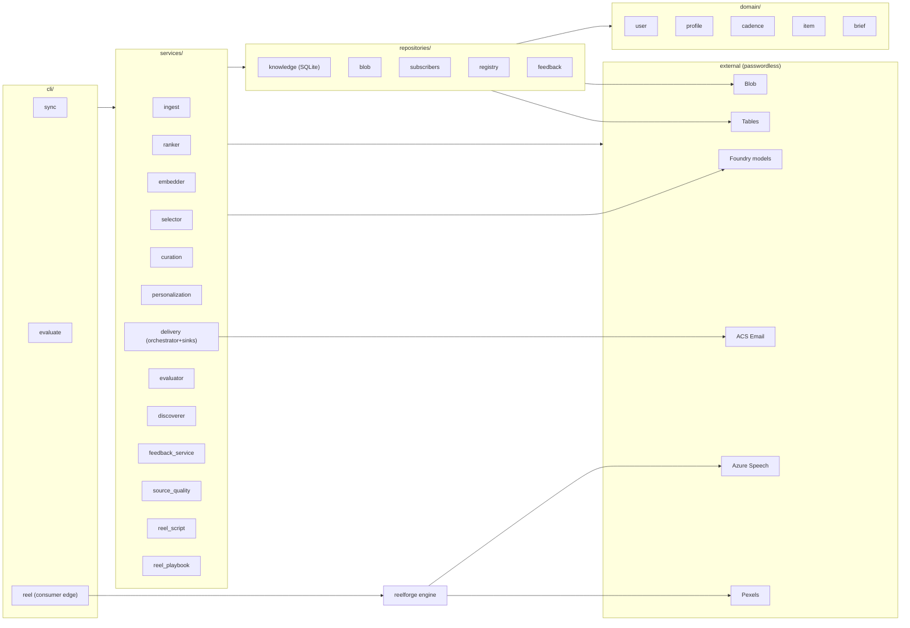
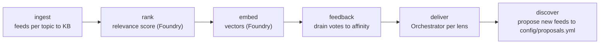
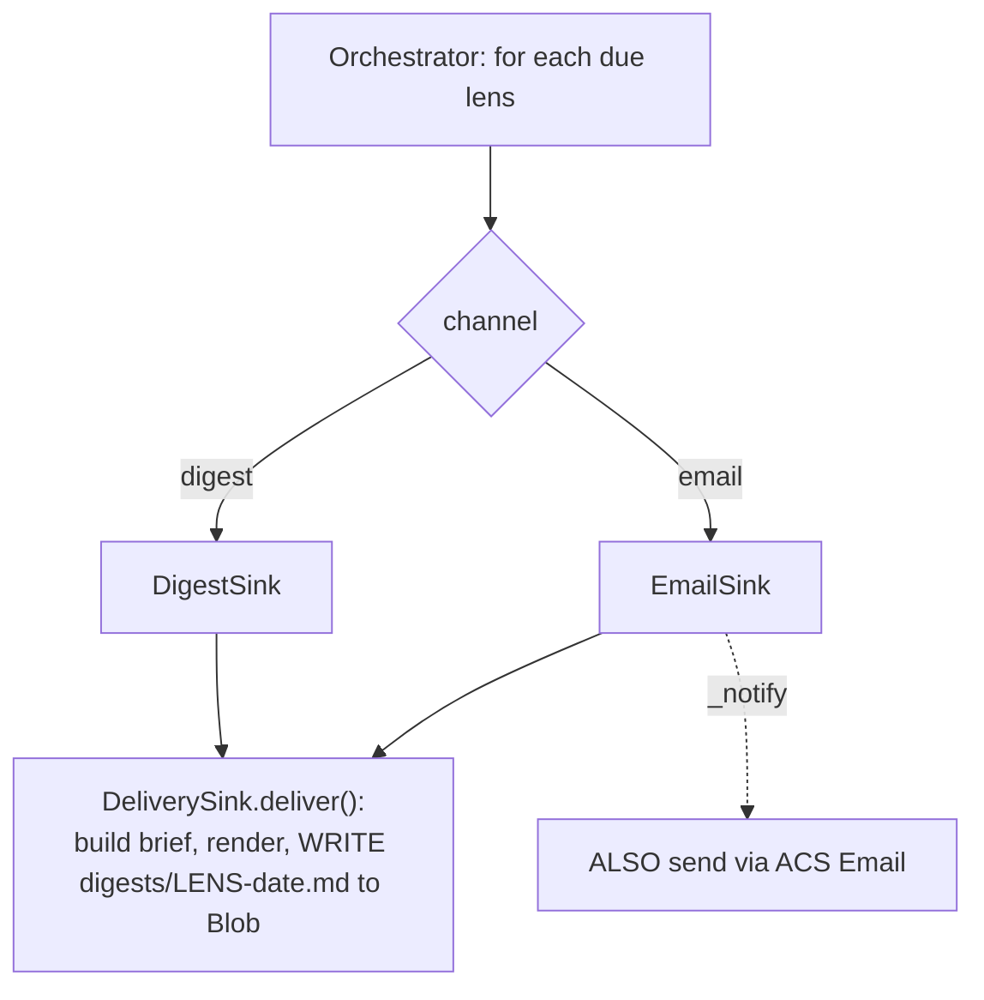
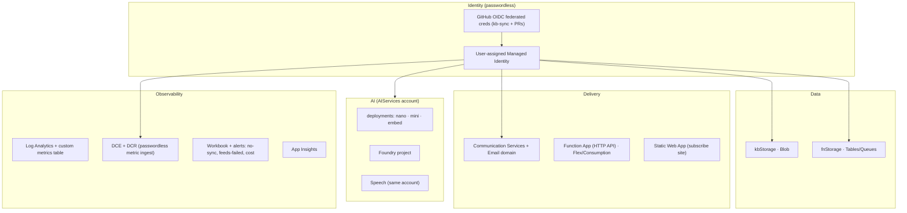

# Architecture

> **Chugh Vibes** (a.k.a. `ai-scout` / `prism`) — a self-growing, passwordless content pipeline
> that ingests sources per **topic**, ranks them, and delivers each audience its own edition:
> email digests for people, a markdown "radar" digest for the autonomous builder, and vertical
> **reels** for social. Built to grow by **config/data, not new code**.

This document is the canonical, high-level map of the system. Read it before any change that
crosses a module boundary, adds a topic/lens/channel, or touches delivery.

---

## 1. Non-negotiable principles

These constrain every design decision below.

- **Passwordless / Entra-first.** All Azure access uses `DefaultAzureCredential` (GitHub OIDC in
  CI, `az login` locally). No keys, connection strings, SAS, or stored secrets.
- **Infra-as-Code first.** [`infra/main.bicep`](../infra/main.bicep) is the source of truth for
  every Azure resource. CLI is for discovery/what-if only.
- **Config over code.** Growth = a row in a table or a file in `config/` / `topics/`, never a new
  code path. Each topic is a self-contained pack in `topics/<id>/`.
- **The eval-gate is the merge authority.** [`pr-gate.yml`](../.github/workflows/pr-gate.yml)
  grades ranking quality on a labeled golden set + compile + offline unit tests on every PR. A PR
  auto-merges only when it's green.
- **Every stage is optional + graceful.** Rank / draft / email / feedback / reel each no-op
  (never crash the pipeline) when their backing service is unconfigured.
- **One ownership per concern.** Identity & audience creation is owned by the registry; consumers
  (email, builder, reel) are **read-only** over the artifacts the pipeline produces.

---

## 2. The core model: three orthogonal axes

Everything is a combination of three independent axes. Keep them orthogonal and the system stays
pluggable.

| Axis | What it is | Where it lives | Add one by |
|---|---|---|---|
| **Topic** | the *subject* (ai, politics, …) | `topics/<id>/` git pack | adding a folder |
| **Lens** | *who consumes & how it's steered* = `topic × interest × channel × cadence` | a row in the `profiles` table | adding a row |
| **Channel** | the *delivery medium* (email, digest) | a `Sink` class | adding a sink |

A **profile is one point** in `Topic × Lens × Channel` space. The reel **user is single**; it owns
**one profile per topic**.



---

## 3. Repository layout

```
prism/                  the application (layered)
  domain/               pure models: user, profile, cadence, item, brief
  repositories/         data access: knowledge (SQLite), blob, subscribers, registry, feedback, models
  services/             business logic (see §5)
    delivery/           orchestrator + sinks (email / digest)
    personalization/    taste model, Thompson/epsilon explorers, novelty
  lib/                  config, settings, foundry/gateway, topics, text, vectors, metrics, flags
  cli/                  entrypoints: sync, evaluate, restore
reelforge/              standalone, domain-agnostic VIDEO ENGINE (ports & adapters)
  domain/               Style, Storyboard, Scene
  render/               compositor, captions, backgrounds, fonts, assets (MoviePy + bundled ffmpeg)
  providers/            tts/azure_speech, visuals/pexels
  assets/               bundled font (Anton, OFL) + music (CC0)
builder/                read-only CONSUMER of the builder lens digest (inbox, review, outcome)
function/               Azure Functions HTTP API (subscribe/confirm/unsubscribe/feedback/...) — standalone deploy
web/                    static subscribe site (Azure Static Web App)
topics/<id>/            self-contained topic packs: pack.json, sources.opml, rubric.txt, tags.json, eval/
config/                 global config: reel.json, playbooks/, curate.json, models.json, flags.json, ...
infra/                  main.bicep (every Azure resource) + params + workbook
tests/                  offline unit + eval tests (the gate)
.github/workflows/      kb-sync, pr-gate, pr-feedback, builder-radar, reel-render, agentics-maintenance
```

**Dependency rule:** `cli → services → repositories → domain`, with `lib` available to all.
`reelforge` depends on nothing in `prism` (the seam is a `Storyboard`). `prism` never depends on
`reelforge` except at the reel CLI edge. Consumers (`builder/`, reel CLI) depend on `prism`
read-only; nothing depends on them.

---

## 4. Layered component view



---

## 5. The data pipeline (`kb-sync`, daily)

One command runs the whole producer side:
`python -m prism.cli.sync --days 7 --rank --feedback --deliver --discover`



- **ingest** ([`services/ingest.py`](../prism/services/ingest.py)) — feedparser over each topic's
  `sources.opml`, dedup into the `Item` table, tagged `topic_id`. SSRF-guarded fetch.
- **rank** ([`ranker.py`](../prism/services/ranker.py)) — Foundry scores unscored items against the
  topic rubric. **embed** ([`embedder.py`](../prism/services/embedder.py)) — stores vectors for the
  two-tower interest match.
- **select** ([`selector.py`](../prism/services/selector.py)) — per lens: candidates filtered by
  `topic_id`, scored = relevance + affinity + interest-match − novelty penalty, then deduped,
  diversified, and explored (Thompson/epsilon in `personalization/`).
- **deliver** ([`delivery/orchestrator.py`](../prism/services/delivery/orchestrator.py)) — see §7.
- **feedback** ([`feedback_service.py`](../prism/services/feedback_service.py)) — drains
  email/web vote events into per-lens affinity (the taste model).

The KB is a single SQLite file mirrored to Blob (download on start, snapshot on finish). It is a
**single-writer** store; only `kb-sync` writes it.

---

## 6. Registry / audience (owns identity)

The audience is the *only* thing that mints IDs and writes the registry tables.

- **`subscribers` table** — one row per audience: `userId`, `kind` (`subscriber` | `admin` |
  `builder` | `reel`), `status`, `email`, `token`.
- **`profiles` table** — `PartitionKey=userId`, `RowKey=profileId`, fields `channel`, `cadence`,
  `interest`, `top`, `min_score`, `self_review`, `topic_id`. A profile **is a lens**;
  `lens = "{userId}:{profileId}"`.
- **ID format:** `usr_<8hex>` / `prf_<8hex>` (`secrets.token_hex(4)`). Generated, opaque; resolution
  is by `kind` + `topic_id`, never by a readable ID.

**Provisioning owners:**
- *People* — the **Function** (`/subscribe → /confirm`) creates the subscriber + default profile.
- *Automation feeds* (builder, reel) — an **admin/registry provisioning capability** mints the IDs
  and writes the rows. **Consumers never provision and never see an ID format.**

> The Function is a **standalone deployment** (only azure libs, no `prism`); its ID minting is an
> inline copy of the same format. The format — not the code — is the shared contract.

---

## 7. Delivery: one producer, channel-routed sinks

`Orchestrator.run()` walks every due profile and dispatches to a **Sink chosen by `profile.channel`**.



- Every channel **writes the same artifact**: `digests/<filesafe_lens>-<date>.md` with a
  machine-readable footer `<!-- items: id,id,... -->` (rank order). This is the universal hand-off.
- `email` additionally **sends** the rendered brief via ACS (RFC-8058 one-click unsubscribe).
- `digest` writes the artifact only; downstream consumers pick it up.

This is why **email is the cheap 90% (no extra infra)** and only the heavy/external consumers are
decoupled.

---

## 8. Consumers (read-only)

Two non-email consumers read their lens's digest from Blob and act. They **cannot** be one workflow
(different runtimes/cadence); they share the **consumer contract**, not a file.

| Consumer | Trigger | Reads | Produces |
|---|---|---|---|
| **builder-radar** | `Mon/Thu` (gh-aw Copilot agent, firewalled) | builder lens digest | GitHub PRs |
| **reel-render** | `on: workflow_run` after kb-sync (daily) | each reel lens digest | reels in `digests/reels/<topic>/` |

### The reel sub-system
- **`reelforge`** is the reusable engine: `render(storyboard, out, tts, visuals) -> mp4`. MoviePy on
  a bundled ffmpeg; Azure Speech TTS (word-synced burned captions — the moat, since reels are
  watched on mute); Pexels b-roll; bundled music. Knows nothing about topics or `prism`.
- **`prism/cli/reel.py`** is the consumer edge: it **enumerates reel profiles** (one per topic),
  and for each: topic ← `profile.topic_id`, creative config ← `topics/<id>/pack.json` `settings.reel`
  merged over `config/reel.json` defaults, consumes that lens's digest (item ids → `Item` rows),
  and renders N deep reels to `digests/reels/<topic>/<date>-deep-k.mp4`. Falls back to live
  selection if a digest is absent.
- **Creative theory** lives in swappable **playbooks** (`config/playbooks/<name>.json`) — a topic
  picks one by name. Editing hooks/structure/pacing is config, never code.

---

## 9. Storage model

| Store | Account | Holds |
|---|---|---|
| **Blob** (`knowledge`) | `kbStorage` | `kb.sqlite` (+ snapshots), `digests/<lens>-<date>.md`, `digests/reels/<topic>/*.mp4`, `source-quality.md` |
| **Tables** | `fnStorage` | `subscribers`, `profiles`, `feedbackTokens`, `feedbackEvents`, `editions` (cached welcome), `rateLimit` |

No PII in git. The KB holds no user data — only items and per-lens sent/affinity state.

---

## 10. Cloud infrastructure (`infra/main.bicep`)



RBAC is least-privilege **data-plane** roles (Storage Blob/Table Data, Cognitive Services User,
Speech User, ACS, Monitoring Metrics Publisher) granted to both the UAMI (CI/runtime) and the
developer principal (local). `assignRoles` gates them for what-if safety.

**Compute is ~$0 / pay-per-use:** GitHub Actions runs the daily pipeline and renders (free on a
public repo); Azure holds only storage + pay-per-call AI/email. No always-on servers.

---

## 11. CI/CD & automation workflows

| Workflow | Trigger | Role |
|---|---|---|
| **kb-sync** | daily `01:07 UTC` + dispatch | the producer: ingest → rank → deliver (email inline + digests) |
| **pr-gate** | every PR | **merge authority**: eval golden-set + compile + offline unit tests + architecture boundary tests; auto-merge on green |
| **pr-feedback** | feedback events | record votes back into affinity |
| **reel-render** | `workflow_run` after kb-sync + dispatch | cloud render of reels per topic |
| **builder-radar** | `Mon/Thu` (gh-aw) | autonomous Copilot agent works the builder digest → PRs |
| **agentics-maintenance** | scheduled | gh-aw housekeeping |

All Azure-touching workflows log in via OIDC (`azure/login`), no secrets. The only secret is the
Pexels b-roll API key.

---

## 12. How to extend (the runbook)

- **Add a topic** → create `topics/<id>/` (pack.json, sources.opml, rubric.txt, tags.json,
  eval/golden.jsonl) — the producer pack holds **no** consumer/reel config. Ingest/rank/eval pick it
  up automatically. To **enable reels** for it, provision a reel feed:
  `python -m prism.cli.feeds add --kind reel --topic <id> --interest "…"` — the interest, cadence,
  and `top` (article-pool size) live on the db profile; the reel layer's own knobs (videos-per-run,
  voice, playbook) live in `config/reel.json`. **No code.**
- **Add a subscriber audience** → a `profiles` row (`channel`, `topic_id`, `interest`, `cadence`).
- **Add a delivery channel** → a new `Sink` subclass + register it in the sink map. (Code, but
  isolated to one seam.)
- **Tune reels** → `config/reel.json` (defaults), the topic pack's `settings.reel`, or a playbook.
- **Tune ranking** → the topic's `rubric.txt` + `eval/golden.jsonl` (the gate scores it).

---

## 13. Pre-launch hardening — DONE

The rushed edges were corrected (each behind the eval-gate):

- **Provisioning has an owner** (PR #43) — `SubscriberStore.provision_feed` mints ids and writes the
  registry; `prism.cli.feeds` is the one reproducible way to create automation feeds. No scratch
  scripts, no hardcoded ids; the reel feed was re-seeded with a generated id.
- **Typed `Edition` + reel as a pure per-topic consumer** (PR #44) — the `Edition` domain type owns
  the digest footer (no more regex helper); reel enumerates one lens per topic, reads each lens's
  `Edition`, and renders to `digests/reels/<topic>/`. Per-topic creative lives in the topic pack;
  the lens's `interest` is the single source of truth.
- **Architecture guards** (PR #45) — boundary tests now ride the gate: reelforge ⊥ prism, domain ⊥
  outer layers, sqlite confined to `repositories/`, consumers never provision.

### The store ceiling (a conscious decision, not an oversight)
The KB is one SQLite file mirrored through Blob snapshots, single-writer. We deliberately did **not**
abstract a `Store` port now — there is exactly one backend, and a speculative interface would be
premature bloat (the same 'a helper/abstraction is a smell' rule). Instead the seam is **already
clean** (only `repositories/` knows it's SQLite) and now **guarded** by a test. **Upgrade trigger:**
when a second writer appears, runs begin to overlap, or the KB outgrows a snapshot-per-run, swap
`KnowledgeBase` for a Postgres+pgvector adapter — a repository-only change, because nothing above it
depends on SQLite.

## 14. Did it get better?

**Better, measurably:**
- "Add a topic's reels" went from *a code change* to *a pack tweak + one `feeds add` row*.
- Three classes of silent failure are now **gated invariants** (Function↔registry schema drift; layer
  violations; the store seam). Green now means more than "ranking still works."
- Two helpers and one duplicated source-of-truth were **deleted**, not added — the design got smaller.

**Cost paid:** one new domain type (`Edition`) and a small admin CLI — both earn their place (they
removed helpers and ad-hoc scripts). Net lines roughly flat; concept count down.

**Still deferred (with triggers, not forgotten):** the store migration (above) and a typed
multi-channel *event* spine (only worth it past ~3 active channels). Building either now would be the
premature-scaling failure mode.

---

*Keep this document current when a module boundary, axis, or ownership rule changes.*
